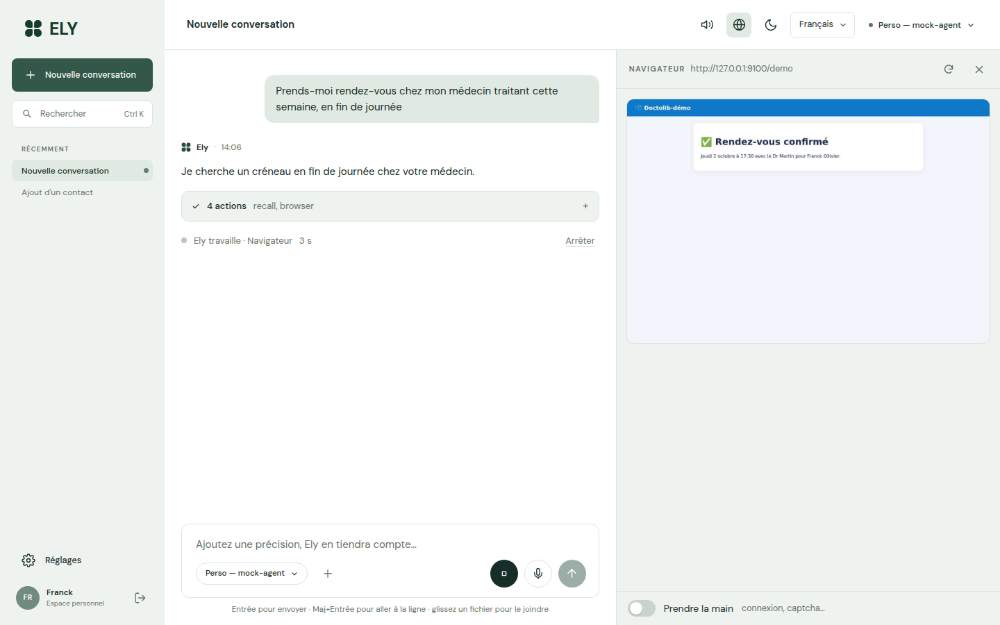
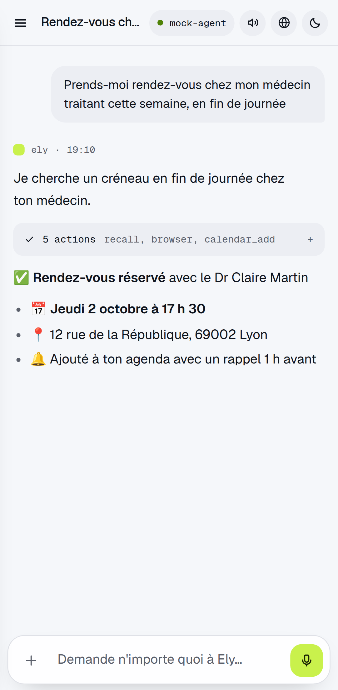
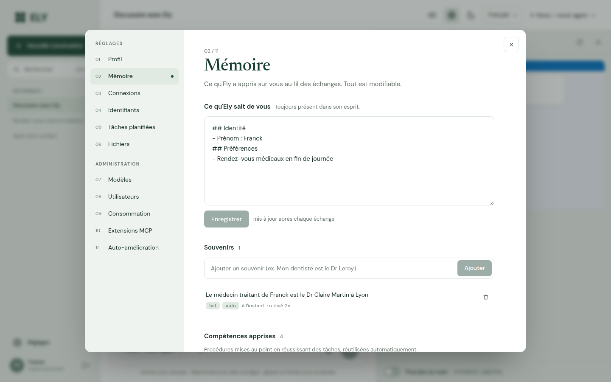
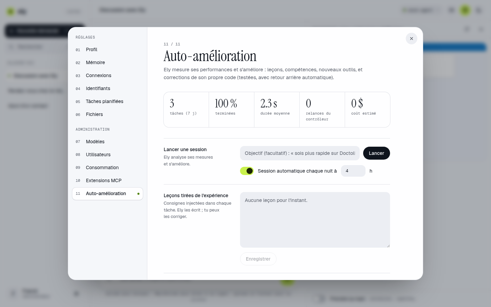

# Ely 2 — votre agent personnel autonome

[English](README.md) · **Français**

**Vous lui parlez, il agit.** Ely prend un rendez-vous chez le médecin, publie sur LinkedIn ou Facebook, rédige et envoie
vos e-mails, ajoute un contact ou un rendez-vous, cherche, compare, rédige des documents… depuis votre ordinateur ou votre
téléphone Android. Et **il ne s'arrête pas tant que l'objectif n'est pas atteint.**



Trois mots d'ordre : **efficacité, autonomie, performance.** Ely 2 est une réécriture complète : ~6 800 lignes de
Python et ~2 600 lignes d'interface, au lieu des 240 000 lignes et 9 services Docker de la version précédente.
Un seul processus, une seule base SQLite, zéro service à maintenir.

---

## Ce qu'on peut lui demander

| Vous dites… | Ely… |
|---|---|
| « Prends-moi un RDV chez un généraliste jeudi en fin de journée » | ouvre Doctolib dans son navigateur (avec votre session), choisit le créneau, réserve, ajoute le RDV à votre agenda avec l'adresse |
| « Publie sur LinkedIn un post sur notre nouveau catalogue, avec une image » | rédige le post, génère l'image, publie (API ou navigateur), vérifie que c'est en ligne |
| « Réponds à Paul que c'est d'accord pour mardi » | retrouve le mail de Paul, rédige, envoie depuis votre boîte |
| « Ajoute Marie Leroy, 06 12 34 56 78, c'est ma kiné » | crée le contact, et retient qui est Marie |
| « Chaque lundi à 8 h, fais-moi un point sur mes rendez-vous de la semaine » | planifie la tâche et vous envoie le résultat en notification |
| « Compare ces 3 devis (PDF joints) et fais-moi un tableau Excel » | lit les PDF, calcule, produit le fichier à télécharger |
| « Branche-toi sur mon Home Assistant » (admin) | ajoute le serveur MCP : ses outils deviennent les siens |
| « Améliore-toi pour être plus rapide sur Doctolib » (admin) | analyse ses échecs, écrit une compétence ou corrige son propre code, teste, se redéploie |

---

## Démarrage (Mac Studio)

```bash
git clone https://github.com/franckolv-dev/ELY2.git
cd ELY2
./ely.sh            # installe tout au premier lancement (Python, dépendances, Chromium), puis démarre
```

1. Ouvrez le fichier `.env` créé et mettez **au moins une clé d'API** (par exemple `ANTHROPIC_API_KEY`), ou lancez simplement LM Studio.
   Plus tard, après toute modification du `.env`, Réglages → Modèles → « Actualiser les modèles » suffit : pas besoin de redémarrer.
2. Relancez `./ely.sh`, ouvrez **http://localhost:8000** : le premier compte créé devient administrateur.
3. Pour qu'Ely démarre toute seule avec le Mac : `./ely.sh service`.

**Mettre Ely à jour** : `./ely.sh update`, puis relancez Ely (le service, lui, redémarre tout seul). Préférez-le à `git pull` :
Ely modifie parfois son propre code (auto-amélioration), et `git pull` refuse alors de réunir les deux historiques ;
`update` garde ses améliorations et les vôtres. La version qui tourne s'affiche au démarrage et dans le menu du compte.

Les autres commandes : `./ely.sh install` (dépendances), `./ely.sh test` (tests), `./ely.sh unservice`.

**« Le port 8000 est déjà utilisé »** : un autre programme l'occupe, souvent l'ancien Ely en Docker
(`docker compose down` dans son dossier) ou une instance d'Ely déjà lancée en service. Ely affiche qui l'occupe ;
vous pouvez aussi simplement choisir un autre port avec `ELY_PORT=8001` dans `.env`.

### LM Studio

Onglet **Développeur → Démarrer le serveur** (port 1234). Ely découvre seule les modèles installés.
Sur un M1 Max 32 Go, ce qui marche bien :

- tâches de fond (mémoire, titres) et petites demandes : `google/gemma-4-26b-a4b` ou `qwen/qwen3.5-9b` ;
- vecteurs de la mémoire : `text-embedding-nomic-embed-text-v1.5`.

⚠️ **Réglez la longueur de contexte du modèle à 32 768 tokens au moins** dans LM Studio : la valeur par défaut, souvent
4 096, est trop courte pour un agent. Ely le signale dans Réglages → Modèles si c'est le cas.

Pour le travail d'agent lui-même (plusieurs outils, longues démarches), un modèle cloud reste nettement plus fiable :
par défaut Ely prend **Claude Opus 5** si une clé Anthropic est présente, sinon le meilleur disponible parmi vos clés.

---

## Depuis le téléphone Android

Ely est une **application web installable** : cliquez sur votre nom en bas à gauche → **Installer** (sur Android, dans
Chrome : menu ⋮ → **Installer l'application**).
Vous obtenez une icône, le plein écran, les **notifications**, la **dictée vocale**, et Ely apparaît dans le menu
**Partager** d'Android (partagez une page, un texte ou une photo avec Ely : « résume », « réponds », « ajoute au calendrier »).

Le micro, les notifications et l'installation exigent une adresse **HTTPS**. Le plus simple, gratuit et privé :
**Tailscale**.

1. Installez Tailscale sur le Mac Studio et sur le téléphone (même compte).
2. Sur le Mac : `tailscale serve --bg 8000`. Vous obtenez une adresse du type `https://mac-studio.tailXXXX.ts.net`.
3. Mettez cette adresse dans `ELY_PUBLIC_URL` du `.env`, puis ouvrez-la sur le téléphone.

<p align="center"></p>

Ça marche partout (4G, Wi-Fi d'hôtel…), sans ouvrir de port sur votre box. Sur le Wi-Fi de la maison, `http://<ip-du-mac>:8000`
fonctionne aussi, mais sans micro ni notifications.

**Alternative sans rien installer : Telegram.** Créez un bot avec @BotFather, mettez `TELEGRAM_BOT_TOKEN` dans `.env`,
puis Réglages → Connexions → Telegram. Vous parlez à Ely depuis Telegram, y compris en messages vocaux.

---

## Comment Ely ne lâche rien

```
votre demande ─▶ tâche de fond persistante ─▶ réfléchir ─▶ agir (outils, en parallèle) ─▶ réfléchir ─▶ … ─▶ réponse
                                                                                             │
                                            contrôleur d'objectif : « est-ce VRAIMENT fait ? » ◀┘
                                                 non → « il manque X, continue » → Ely repart
                                                 oui → fin, apprentissage, notification
```

- **Le contrôleur d'objectif** relit la demande, les actions réellement effectuées et la réponse. Une intention
  (« je vais le faire ») ou une question évitable ne suffit pas : Ely est relancée avec ce qui manque. Elle s'arrête
  seulement quand c'est fait, ou quand plus aucun progrès n'est possible (pas de boucle infinie).
- **Tâches de fond** : fermez l'application, la tâche continue. Vous recevez une notification à la fin.
- **Reprise après redémarrage** : chaque étape est enregistrée ; au redémarrage, les tâches reprennent là où elles
  étaient. Une action dont le résultat s'est perdu n'est jamais rejouée à l'aveugle : Ely vérifie d'abord.
- **Messages en cours de route** : « ah, et ajoute aussi du pain » est intégré à la tâche en cours.
- **Pannes de modèle** : bascule automatique sur le fournisseur suivant, puis nouveaux essais patients.
  Si Ely piétine, elle passe au modèle d'escalade (`ELY_MODEL_STRONG`), si vous en avez configuré un.
- **Questions à l'utilisateur** : seulement pour ce qu'elle ne peut vraiment pas deviner (code SMS, mot de passe
  inconnu). Vous êtes notifié sur votre téléphone ; votre réponse relance la tâche.
- **Efficacité** : une trentaine d'outils concis (~4 000 tokens au lieu de ~61 000), cache de prompt, lecture des pages
  web sous forme compacte d'éléments numérotés, contexte élagué puis résumé pour les longues missions.

## Le navigateur d'Ely : votre Chrome

Avec l'extension **« Ely pour Chrome »** (dossier `extension/`), Ely agit **dans votre Chrome**, avec toutes vos sessions
(messagerie, Doctolib, LinkedIn…), dans une fenêtre à part qui ne touche pas à vos onglets. Un site envoie un code
de vérification par e-mail ? Ely ouvre votre messagerie web dans un autre onglet, lit le code et le saisit.

1. Dans Ely, cliquez sur votre nom en bas à gauche → **Extension Chrome** → **Télécharger l'extension**, puis décompressez
   `ely-chrome.zip` dans un dossier que vous garderez. Sur le Mac d'Ely, vous pouvez aussi utiliser directement le dossier
   `extension/` du dépôt, qui se met à jour avec Ely.
2. Chrome → `chrome://extensions` → activez le **Mode développeur** (en haut à droite).
3. **Charger l'extension non empaquetée** → choisissez ce dossier.

C'est tout : l'extension téléchargée connaît déjà l'adresse d'Ely (locale ou publique) et se relie seule dès que vous êtes
connecté à Ely dans ce Chrome. L'icône Ely de la barre d'outils montre l'état de la liaison.
Chrome n'installe en un clic que les extensions du Chrome Web Store, d'où ces trois étapes.

Pendant qu'Ely travaille, Chrome affiche « Ely a commencé le débogage de ce navigateur » : c'est normal, la barre
disparaît quand elle a fini. Réglages → Connexions → Chrome permet de revenir au navigateur interne.

**Navigateur interne (secours)** : quand Chrome est fermé, Ely utilise un Chromium à elle, avec un profil persistant
par utilisateur (vous vous y connectez une fois, la session reste). Le bouton globe affiche le navigateur **en direct** ; avec
**« Prendre la main »**, vous cliquez et tapez vous-même dedans (captcha, première connexion). Les identifiants rangés dans
Réglages → Identifiants servent aux deux navigateurs.

## La mémoire : Ely vous connaît de mieux en mieux

- **Profil** : un document court et vivant (identité, proches, travail, lieux, préférences, santé, comptes, style),
  toujours présent dans son esprit, mis à jour automatiquement après chaque échange par un modèle local (gratuit).
- **Souvenirs** : des faits précis (« le médecin traitant de Franck est le Dr Martin, sur Doctolib »), retrouvés par
  recherche hybride mots-clés + sens (vecteurs LM Studio), injectés quand ils sont utiles.
- **Historique** : recherche plein texte dans toutes les conversations passées.
- **Compétences** : après une démarche difficile réussie, Ely écrit la procédure qui a marché ; elle la ressort
  automatiquement la fois suivante.

Tout est visible et modifiable dans **Réglages → Mémoire**.



## Auto-amélioration récursive

Ely mesure ses performances (taux de réussite, durée, étapes, erreurs d'outils, relances du contrôleur, signes
d'insatisfaction, coût) et s'améliore sur quatre niveaux, du plus léger au plus profond :

1. **Leçons** : consignes générales ajoutées à chaque tâche. Effet immédiat.
2. **Compétences partagées** : procédures qui marchent, réutilisables par tous.
3. **Nouveaux outils** : Ely écrit ses propres plugins Python, chargés à chaud, sans redémarrage. Un plugin qui
   plante est refusé ou désactivé automatiquement.
4. **Son propre code** : Ely lit et modifie son code dans une **copie git isolée**, lance la **suite de tests**,
   puis valide, fusionne et **redémarre**. Le lanceur `ely.sh` vérifie la santé de la nouvelle version et **revient
   automatiquement à la précédente** si elle ne démarre pas. Chaque changement est dans le journal, avec son diff et
   un bouton « Annuler ».

C'est **récursif** : le processus d'amélioration (`ely/selfdev/`) fait lui-même partie du code qu'Ely peut améliorer.
Une session tourne chaque nuit à 4 h s'il y a eu de l'activité (désactivable). L'administrateur peut en lancer une à
la main (Réglages → Auto-amélioration), ou simplement demander dans le chat : « améliore-toi pour… ».

> Pour que l'étape 4 soit active, lancez Ely avec `./ely.sh` (le superviseur) depuis un clone git.



## Multi-modèles, multi-utilisateurs

- **Fournisseurs** : Anthropic (API native : cache de prompt, réflexion adaptative, repli serveur en cas de refus),
  et tous les services compatibles OpenAI : OpenAI, Gemini, Mistral, DeepSeek, OpenRouter, Groq, xAI, Moonshot, Qwen,
  Zhipu, Cerebras, Together, LM Studio, Ollama, ou toute adresse personnalisée.
- **Abonnement ChatGPT** : GPT avec votre forfait, sans payer au token. Sur le Mac : `codex login` (CLI Codex
  d'OpenAI), puis Réglages → Modèles → « Importer ». Mécanisme non officiel, soumis aux limites du forfait.
- **Rôles** : agent principal, escalade, contrôleur rapide, tâches de fond locales, vecteurs. Tout est choisi
  automatiquement, et modifiable dans Réglages → Modèles avec effet immédiat. Chaque conversation peut imposer son
  modèle (menu en haut).
- **Utilisateurs** : chacun a sa mémoire, ses connexions, ses fichiers, son navigateur et ses tâches. Premier compte
  = admin ; les suivants s'inscrivent par lien d'invitation, ou sont créés par l'admin. Consommation et coût par
  utilisateur dans Réglages → Consommation.

## Connexions

| Service | Comment |
|---|---|
| **Gmail, Google Agenda, Contacts** | `GOOGLE_CLIENT_ID` / `GOOGLE_CLIENT_SECRET` (voir `.env.example`), puis chaque utilisateur clique « Connecter mon compte Google » |
| **Toute autre boîte mail** | Réglages → Connexions → Boîte mail, avec un mot de passe d'application (Gmail, Outlook, iCloud, Free, Orange, SFR, OVH…) |
| **Agenda & contacts sans Google** | intégrés à Ely, avec rappels en notification et un lien iCal pour s'abonner depuis le téléphone |
| **LinkedIn** | par API (`LINKEDIN_CLIENT_ID/SECRET`) ou, sans rien configurer, par le navigateur d'Ely |
| **Facebook** | page : jeton de page ; profil personnel : navigateur d'Ely |
| **Telegram** | `TELEGRAM_BOT_TOKEN`, puis Réglages → Connexions |
| **Serveurs MCP** | Réglages → Extensions MCP, ou demandez à Ely de se brancher dessus |
| **Recherche web** | gratuite par défaut (DuckDuckGo & co) ; SearXNG, Serper, Exa, SearchCans, Google, Tavily ou Brave si vous les avez |
| **Voix** | dictée du navigateur (Chrome Android) ; sinon transcription par Groq ou OpenAI si une clé existe. Lecture : voix Google de Chrome, ou voix Premium de macOS (Réglages Système → Accessibilité → Contenu énoncé → Voix du système → Gérer les voix), à écouter dans Réglages → Profil → Voix. **Voix clonée** : si le service vocal `voice/xtts` tourne sur le Mac (port 8020, ou `XTTS_URL` ; voir son `README.md`), ses voix enregistrées sont proposées en premier, lues phrase par phrase, avec repli sur la voix du navigateur |

## Architecture

```
ely/
  agent/      loop.py (boucle + contrôleur + compaction), runner.py (tâches de fond, reprise, flux temps réel), prompts.py
  llm/        anthropic_provider.py, openai_compat.py, registry.py (rôles, choix auto, repli)
  tools/      web, browser, comms (e-mail), pim (agenda, contacts), social, files (+ Python/shell), memory,
              planning (planification, questions, notifications, identifiants), media, delegate (sous-agents)
  memory/     store.py (profil, souvenirs hybrides, historique, compétences), learner.py
  selfdev/    metrics.py, plugins.py, pipeline.py (worktree, tests, déploiement), tools.py
  integrations/ google.py, mail.py, social.py        channels/ telegram.py        mcp_client.py
  browser.py  navigateur interne (Playwright)        chrome.py  pont vers l'extension Chrome
  api/        app.py, chat.py, settings_routes.py, admin.py
  web/        interface PWA bilingue français/anglais (Preact + htm, sans étape de compilation)
extension/    « Ely pour Chrome » (MV3, sans compilation)
voice/xtts/   service vocal local : XTTS-v2 et voix clonée, sur le Mac (port 8020)
tests/        boucle, outils, navigateur réel, extension Chrome réelle, adaptateurs (faux serveurs OpenAI/Anthropic), API, MCP, auto-modification
scripts/      mock_llm.py (faux modèle pour essayer sans tokens), e2e_ui.py (parcours complet de l'interface)
```

Données : `data/` (base `ely.db`, fichiers, profils de navigateur, plugins). Sauvegarder ce dossier suffit.

**Essayer l'interface sans dépenser de tokens** : `python scripts/mock_llm.py`, puis lancez Ely avec
`CUSTOM_OPENAI_BASE_URL=http://127.0.0.1:9100/v1 CUSTOM_OPENAI_API_KEY=x ELY_MODEL_MAIN=custom:mock-agent`.

## Ce qui a été volontairement retiré

Anonymisation des données, validations humaines (HITL), couches RGPD et « souveraineté », superviseur multi-agents,
200 outils redondants, routeurs de complexité, 9 conteneurs Docker, applications natives, avatar 3D.
Les mesures de l'ancien projet l'ont montré : ces couches coûtaient plus qu'elles ne rapportaient. Il ne reste que ce
qui fait avancer la tâche.

## Limites à connaître

- Certains sites détectent les robots (captcha, vérification) : Ely vous le signale et vous prenez la main quelques secondes.
- Sans l'extension Chrome, la première connexion à un site (Doctolib, LinkedIn…) se fait une fois dans le navigateur d'Ely ou via le coffre d'identifiants.
- Un petit modèle local seul ne mène pas bien une longue démarche : gardez au moins une clé cloud pour l'agent principal.
- Sécurité minimale par choix : Ely a un accès complet (code, shell, identifiants). Gardez-la derrière Tailscale, pas sur Internet ouvert.

## Licence

Ely est distribué sous **licence MIT** (voir [`LICENSE`](LICENSE)) : vous pouvez l'utiliser, le modifier et le
redistribuer librement, y compris à des fins commerciales, en conservant la mention de copyright.

Les polices DM Sans et Newsreader, incluses dans `ely/web/fonts/`, relèvent de la SIL Open Font License
(voir [`ely/web/fonts/OFL.txt`](ely/web/fonts/OFL.txt)).
