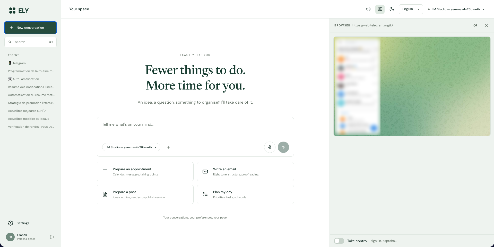
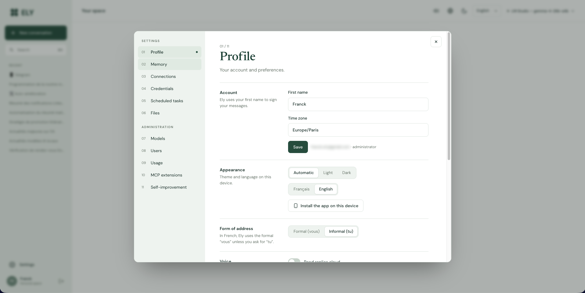
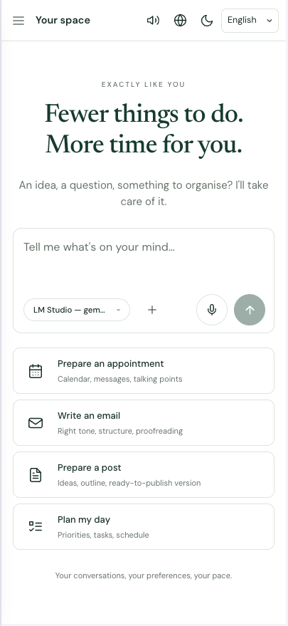
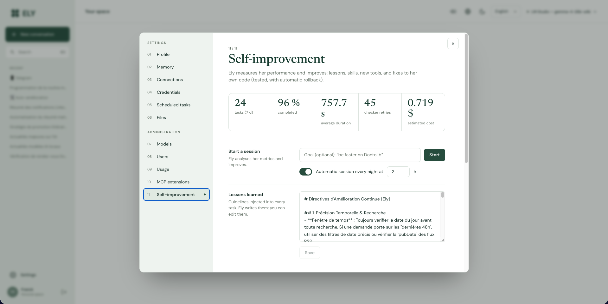

# Ely — your autonomous personal agent

**English** · [Français](README.fr.md)

**You talk to it, it acts.** Ely books a doctor's appointment, posts on LinkedIn or Facebook, writes and sends your
emails, adds a contact or an event, searches, compares, drafts documents… from your computer or your Android phone.
And **it doesn't stop until the goal is reached.**



Three watchwords: **efficiency, autonomy, performance.** Version 4.0.0 is a complete rewrite, following
[ElyAgent](https://github.com/franckolv-dev/ElyAgent)'s 3.1.0 (see the [changelog](CHANGELOG.md), in French): ~8,300
lines of Python and ~2,900 lines of interface, instead of the previous version's 240,000 lines and 9 Docker services.
One process, one SQLite database, zero services to maintain.

The interface is bilingual (English / French, formal "vous" by default), and Ely answers in your language.



---

## What you can ask

| You say… | Ely… |
|---|---|
| "Book me an appointment with a GP on Thursday, late afternoon" | opens Doctolib in its browser (with your session), picks the slot, books, adds the appointment and address to your calendar |
| "Post on LinkedIn about our new catalogue, with an image" | writes the post, generates the image, publishes (API or browser), checks it is live |
| "Tell Paul Tuesday works for me" | finds Paul's email, writes the reply, sends it from your mailbox |
| "Add Marie Leroy, +33 6 12 34 56 78, she's my physiotherapist" | creates the contact, and remembers who Marie is |
| "Every Monday at 8 am, give me a rundown of my week's appointments" | schedules the task and sends you the result as a notification |
| "Compare these 3 quotes (attached PDFs) and make me an Excel table" | reads the PDFs, calculates, produces the file to download |
| "Connect to my Home Assistant" (admin) | adds the MCP server: its tools become Ely's own |
| "Improve yourself to be faster on Doctolib" (admin) | analyses its failures, writes a skill or fixes its own code, tests, redeploys |

---

## Getting started (Mac Studio)

```bash
git clone https://github.com/franckolv-dev/ELY2.git
cd ELY2
./ely.sh            # installs everything on first run (Python, dependencies, Chromium), then starts
```

1. Open the generated `.env` file and add **at least one API key** (for example `ANTHROPIC_API_KEY`), or simply start LM Studio.
   Later, after any change to `.env`, Settings → Models → "Refresh models" is enough: no restart needed.
2. Run `./ely.sh` again and open **http://localhost:8000**: the first account created becomes the administrator.
3. To start Ely automatically with the Mac: `./ely.sh service`.

**Updating Ely**: `./ely.sh update`, then restart Ely (the service restarts on its own). Prefer it to `git pull`:
Ely sometimes changes its own code (self-improvement), and `git pull` then refuses to reconcile the two histories;
`update` keeps both its improvements and yours. The running version is shown at startup and in the account menu.

Other commands: `./ely.sh install` (dependencies), `./ely.sh test` (tests), `./ely.sh unservice`.

**"Port 8000 is already in use"**: another program holds it, often the old Docker-based Ely
(`docker compose down` in its folder) or an instance of Ely already running as a service. Ely shows which program it is;
you can also simply pick another port with `ELY_PORT=8001` in `.env`.

### LM Studio

**Developer** tab → **Start server** (port 1234). Ely discovers the installed models on its own.
On an M1 Max with 32 GB, these work well:

- background tasks (memory, titles) and small requests: `google/gemma-4-26b-a4b` or `qwen/qwen3.5-9b`;
- memory embeddings: `text-embedding-nomic-embed-text-v1.5`.

⚠️ **Set the model's context length to at least 32,768 tokens** in LM Studio: the default, often 4,096, is too short
for an agent. Ely flags it in Settings → Models if that's the case.

For the agent work itself (several tools, long procedures), a cloud model remains far more reliable:
by default Ely uses **Claude Opus 5** if an Anthropic key is present, otherwise the best model available among your keys.

---

## From your Android phone

Ely is an **installable web app**: click your name at the bottom left → **Install** (on Android, in Chrome:
menu ⋮ → **Install app**).
You get an icon, full screen, **notifications**, **voice dictation**, and Ely appears in Android's **Share** menu
(share a page, some text or a photo with Ely: "summarise", "reply", "add to calendar").

The microphone, notifications and installation require an **HTTPS** address. The simplest option, free and private:
**Tailscale**.

1. Install Tailscale on the Mac Studio and on the phone (same account).
2. On the Mac: `tailscale serve --bg 8000`. You get an address like `https://mac-studio.tailXXXX.ts.net`.
3. Put this address in `ELY_PUBLIC_URL` in `.env`, then open it on the phone.

<p align="center"></p>

It works everywhere (4G, hotel Wi-Fi…), without opening any port on your router. On your home Wi-Fi,
`http://<mac-ip>:8000` works too, but without microphone or notifications.

**Alternative with nothing to install: Telegram.** Create a bot with @BotFather, put `TELEGRAM_BOT_TOKEN` in `.env`,
then Settings → Connections → Telegram. You talk to Ely from Telegram, voice messages included.

---

## How Ely never gives up

```
your request ─▶ persistent background task ─▶ think ─▶ act (tools, in parallel) ─▶ think ─▶ … ─▶ answer
                                                                                              │
                                                     goal controller: "is it REALLY done?" ◀──┘
                                                         no  → "X is missing, keep going" → Ely resumes
                                                         yes → done, learning, notification
```

- **The goal controller** rereads the request, the actions actually performed and the answer. An intention
  ("I'll do it") or an avoidable question is not enough: Ely is sent back with what's missing. It stops
  only when the job is done, or when no further progress is possible (no infinite loop).
- **Background tasks**: close the app, the task keeps going. You get a notification at the end.
- **Resume after restart**: every step is recorded; after a restart, tasks pick up where they left off.
  An action whose result was lost is never blindly replayed: Ely checks first.
- **Messages along the way**: "oh, and add bread too" is folded into the running task.
- **Model outages**: automatic switch to the next provider, then patient retries.
  As soon as the controller finds the goal isn't met, or when you ask for it ("use the strong model"), Ely moves up
  to the escalation model (`ELY_MODEL_STRONG`), if you've configured one.
- **Questions to the user**: only for what it truly can't guess (SMS code, unknown password).
  You're notified on your phone; your answer resumes the task.
- **Efficiency**: about thirty concise tools (~4,000 tokens instead of ~61,000), prompt caching, web pages read
  as a compact list of numbered elements, context pruned then summarised for long missions.

## Ely's browser: your Chrome

With the **"Ely for Chrome"** extension (`extension/` folder), Ely acts **in your Chrome**, with all your sessions
(email, Doctolib, LinkedIn…), in a separate window that leaves your tabs alone. A site sends a verification code
by email? Ely opens your webmail in another tab, reads the code and types it in.

1. In Ely, click your name at the bottom left → **Chrome extension** → **Download the extension**, then unzip
   `ely-chrome.zip` into a folder you'll keep. On Ely's Mac, you can also use the repository's `extension/` folder
   directly, which is updated along with Ely.
2. Chrome → `chrome://extensions` → turn on **Developer mode** (top right).
3. **Load unpacked** → choose that folder.

That's it: the downloaded extension already knows Ely's address (local or public) and links up by itself as soon as
you're signed in to Ely in that Chrome. The Ely icon in the toolbar shows the link status.
Chrome only installs Chrome Web Store extensions in one click, hence these three steps.

While Ely is working, Chrome shows "Ely started debugging this browser": that's expected, the bar
disappears when it's done. Settings → Connections → Chrome lets you switch back to the built-in browser.

**Built-in browser (fallback)**: when Chrome is closed, Ely uses its own Chromium, with a persistent profile
per user (you sign in once, the session stays). The globe button shows the browser **live**; with
**"Take control"**, you click and type in it yourself (captcha, first sign-in). Credentials stored in
Settings → Credentials work in both browsers.

## Memory: Ely gets to know you better and better

- **Profile**: a short, living document (identity, family, work, places, preferences, health, accounts, style),
  always in its mind, updated automatically after each exchange by a local model (free).
- **Memories**: precise facts ("Franck's GP is Dr Martin, on Doctolib"), retrieved by hybrid keyword + meaning
  search (LM Studio embeddings), injected when useful.
- **History**: full-text search across all past conversations.
- **Skills**: after a difficult procedure succeeds, Ely writes down what worked; it brings it back
  automatically the next time.

Everything is visible and editable in **Settings → Memory**.

## Recursive self-improvement

Ely measures its own performance (success rate, duration, steps, tool errors, controller retries, signs
of dissatisfaction, cost) and improves on four levels, from the lightest to the deepest:

1. **Lessons**: general guidelines added to every task. Immediate effect.
2. **Shared skills**: procedures that work, reusable by everyone.
3. **New tools**: Ely writes its own Python plugins, hot-loaded, no restart. A plugin that
   crashes is rejected or disabled automatically.
4. **Its own code**: Ely reads and changes its code in an **isolated git copy**, runs the **test suite**,
   then commits, merges and **restarts**. The `ely.sh` launcher checks the health of the new version and
   **automatically rolls back** to the previous one if it doesn't start. Every change is in the log, with its diff and
   an "Undo" button.

To understand a failure, the session reads back the full course of past tasks (requests, actions, exact errors,
controller refusals): "work out why you failed to order on that site" is enough.

It's **recursive**: the improvement process (`ely/selfdev/`) is itself part of the code Ely can improve.
A session runs every night at 4 am if there was any activity (can be turned off). The administrator can start one
by hand (Settings → Self-improvement), or simply ask in the chat: "improve yourself to…". These sessions use their
own model (Settings → Models → Self-improvement; automatic: the escalation model).

> For step 4 to be active, start Ely with `./ely.sh` (the supervisor) from a git clone.

### Handing self-improvement to Claude (optional)

Ely can hand each whole session to **Claude Code**, through the [Claude Agent SDK](https://code.claude.com/docs/en/agent-sdk/overview).
Claude works on its own in the working copy: it reads and edits files, runs the tests and deploys with Ely's tools,
without a terminal and without access outside the copy (`.env`, `data/`, `.git` are refused). Ely restarts at the end
of the mission, never in the middle; if Claude doesn't answer, the session carries on with the escalation model. If its
quota runs out mid-mission, Ely records what it did (Files → `auto-amelioration/`) and restarts the mission with the
escalation model, giving it that context.

1. Put your key in `.env`: `ANTHROPIC_API_KEY=sk-ant-…`
2. `./ely.sh install`: installs the SDK (about 250 MB with its CLI) as soon as a key is present.
3. Settings → Models → "Refresh models", then **Self-improvement**: `claude:claude-opus-5-5`.
   The "Claude (Agent SDK)" row checks the connection ("Test") and sets the budget per mission ($5 by default).

With an API key, Claude is billed per token: Ely never picks it on its own, you choose it.



## Multi-model, multi-user

- **Providers**: Anthropic (native API: prompt caching, adaptive thinking, server-side fallback on refusal),
  and every OpenAI-compatible service: OpenAI, Gemini, Mistral, DeepSeek, OpenRouter, Groq, xAI, Moonshot, Qwen,
  Zhipu, Cerebras, Together, LM Studio, Ollama, or any custom endpoint.
- **ChatGPT subscription**: GPT on your plan, no per-token billing. On the Mac: `codex login` (OpenAI's Codex
  CLI), then Settings → Models → "Import". Unofficial mechanism, subject to your plan's limits.
- **Roles**: main agent, escalation, self-improvement, fast controller, local background tasks, embeddings. Everything is chosen
  automatically, and can be changed in Settings → Models with immediate effect. Each conversation can pin its own
  model (menu at the top).
- **Users**: each has their own memory, connections, files, browser and tasks.
  - The first account is the administrator. It is created on Ely's own machine (http://localhost:8000).
  - The following ones sign up with an invitation link (single use, valid 7 days), or are created by the admin.
  - Python and the terminal run on the machine: they are reserved to the administrator, unless
    `ELY_ALLOW_CODE_FOR_ALL=true`. So is the home network (router, NAS, LM Studio).
  - Changing a password closes the other sessions. Repeated password guesses are slowed down and the person is
    notified. Behind a proxy running on another machine than the Mac, declare its address in `ELY_TRUSTED_PROXIES`.
  - Usage and cost per user in Settings → Usage.

## Connections

| Service | How |
|---|---|
| **Gmail, Google Calendar, Contacts** | `GOOGLE_CLIENT_ID` / `GOOGLE_CLIENT_SECRET` (see `.env.example`), then each user clicks "Connect my Google account" |
| **Any other mailbox** | Settings → Connections → Mailbox, with an app password (Gmail, Outlook, iCloud, and French providers such as Free, Orange, SFR, OVH…) |
| **Calendar & contacts without Google** | built into Ely, with notification reminders and an iCal link to subscribe from your phone |
| **LinkedIn** | via the API (`LINKEDIN_CLIENT_ID/SECRET`) or, with nothing to configure, through Ely's browser |
| **Facebook** | page: page token; personal profile: Ely's browser |
| **Telegram** | `TELEGRAM_BOT_TOKEN`, then Settings → Connections |
| **MCP servers** | Settings → MCP extensions, or ask Ely to connect to one |
| **Web search** | free by default (DuckDuckGo & co); SearXNG, Serper, Exa, SearchCans, Google, Tavily or Brave if you have them |
| **Voice** | browser dictation (Chrome on Android); otherwise transcription by Groq or OpenAI if a key exists. Reading aloud: Chrome's Google voice, or macOS Premium voices (System Settings → Accessibility → Spoken Content → System Voice → Manage Voices), to try in Settings → Profile → Voice. **Cloned voice**: if the `voice/xtts` voice service runs on the Mac (port 8020, or `XTTS_URL`; see its `README.md`), its recorded voices come first, read sentence by sentence, falling back to the browser voice |

## Architecture

```
ely/
  agent/      loop.py (loop + controller + compaction), runner.py (background tasks, resume, live stream), prompts.py
  llm/        anthropic_provider.py, openai_compat.py, registry.py (roles, automatic choice, fallback)
  tools/      web, browser, comms (email), pim (calendar, contacts), social, files (+ Python/shell), memory,
              planning (scheduling, questions, notifications, credentials), media, delegate (sub-agents)
  memory/     store.py (profile, hybrid memories, history, skills), learner.py
  selfdev/    metrics.py, plugins.py, pipeline.py (worktree, tests, deployment), tools.py
  integrations/ google.py, mail.py, social.py        channels/ telegram.py        mcp_client.py
  browser.py  built-in browser (Playwright)          chrome.py  bridge to the Chrome extension
  api/        app.py, chat.py, settings_routes.py, admin.py
  web/        bilingual English/French PWA (Preact + htm, no build step)
extension/    "Ely for Chrome" (MV3, no build step)
voice/xtts/   local voice service: XTTS-v2 and cloned voice, on the Mac (port 8020)
tests/        loop, tools, real browser, real Chrome extension, adapters (fake OpenAI/Anthropic servers), API, MCP, self-modification
scripts/      mock_llm.py (fake model to try without tokens), e2e_ui.py (full interface walkthrough)
```

Data: `data/` (`ely.db` database, files, browser profiles, plugins). Backing up this folder is enough.

**Try the interface without spending tokens**: `python scripts/mock_llm.py`, then start Ely with
`CUSTOM_OPENAI_BASE_URL=http://127.0.0.1:9100/v1 CUSTOM_OPENAI_API_KEY=x ELY_MODEL_MAIN=custom:mock-agent`.

## What was deliberately removed

Data anonymisation, human-in-the-loop approvals (HITL), GDPR and "sovereignty" layers, multi-agent supervisor,
200 redundant tools, complexity routers, 9 Docker containers, native apps, 3D avatar.
Measurements on the previous project showed it: these layers cost more than they returned. Only what moves
the task forward remains.

## Known limits

- Some sites detect bots (captcha, verification): Ely tells you and you take over for a few seconds.
- Without the Chrome extension, the first sign-in to a site (Doctolib, LinkedIn…) happens once in Ely's browser or through the credentials vault.
- A small local model alone doesn't handle a long procedure well: keep at least one cloud key for the main agent.
- Minimal security by design: Ely has full access (code, shell, credentials). Keep it behind Tailscale, not on the open Internet.

## License

Ely is released under the **MIT license** (see [`LICENSE`](LICENSE)): you may use, modify and redistribute it
freely, including for commercial purposes, as long as you keep the copyright notice.

The DM Sans and Newsreader fonts, included in `ely/web/fonts/`, are under the SIL Open Font License
(see [`ely/web/fonts/OFL.txt`](ely/web/fonts/OFL.txt)).
